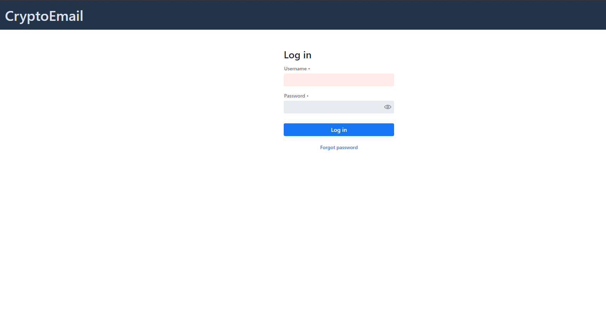
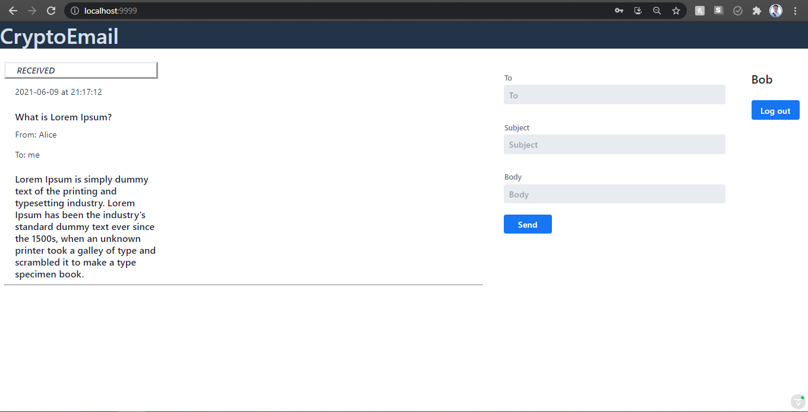

# An Application for secure email exchange: encryption-decryption with AES in ECB mode, including secure delivery of the secret key with RSA and signature based on EL-GAMAL, using the Hash function SHA-256

## Running the Application

There are two ways to run the application : using `mvn spring-boot:run` or by running the `Application` class directly from your IDE.

Below are the configuration details to start the project using a `spring-boot:run` command. Both Eclipse and Intellij IDEA are covered.

#### Eclipse

- Right click on a project folder and select `Run As` --> `Maven build..` . After that a configuration window is opened.
- In the window set the value of the **Goals** field to `spring-boot:run`
- You can optionally select `Skip tests` checkbox
- All the other settings can be left to default

Once configurations are set clicking `Run` will start the application

#### Intellij IDEA

- On the right side of the window, select Maven --> Plugins--> `spring-boot` --> `spring-boot:run` goal
- Optionally, you can disable tests by clicking on a `Skip Tests mode` blue button.

Clicking on the green run button will start the application.

After the application has started, you can view your it at http://localhost:9999/ in your browser.

(You can change the port from `application.properties` under `src/main/resources`. ( i.e. `src/main/resources/application.properties`)

If you want to run the application locally in the production mode, use `spring-boot:run -Pproduction` command instead.

## Project overview

Project follow the Maven's directory layout structure:

- Under the `srs/main/java/com.packagename.chat` are located Application sources
  - `Application.java` is a runnable Java application class and a starting point
  - `GreetService.java` is a Spring service class
  - `MainView.java` is a default view and entry point of the application
  - `User.java` is a Model Class of a user
- Under the `srs/main/java/DAO` are located Application logic sources
  - `DAO/AES.java` is a service class with implementation of AES algorithm in ECB mode
  - `DAO/ElGamalSignatureInstance.java` is a service class with implementation of El Gamal algorithm of handling the digital signature
  - `DAO/IRSA.java` is an Interface of RSA algorithm
  - `DAO/RSAImpl.java`is a service class with implementation of RSA algorithm methods 
  - `DAO/Utils.java` is a service util class for RSAImpl 
- Under the `srs/test` are located test files
- `src/main/resources` contains configuration files and static resources
- The `frontend` directory in the root folder contains client-side dependencies and resource files
  - All CSS styles used by the application are located under the root directory `frontend/styles`
  - Templates would be stored under the `frontend/src`

## Notes

If you run application from a command line, remember to prepend a `mvn` to the command.

## Example

**This is the login page:**  
--------------------------------------------------------------------------------------------------------------------------------------------------------------------
There are 2 users in the system  
**user #1:        username: Alice , password: 123**  
**user #2:        username: Bob   , password: 123**
--------------------------------------------------------------------------------------------------------------------------------------------------------------------

--------------------------------------------------------------------------------------------------------------------------------------------------------------------

**After sending the message from Alice to Bob, this is what will be seen on Alice's screen:**

 

--------------------------------------------------------------------------------------------------------------------------------------------------------------------

**After sending the message from Alice to Bob, this is what will be seen on Bob's screen:**

--------------------------------------------------------------------------------------------------------------------------------------------------------------------
